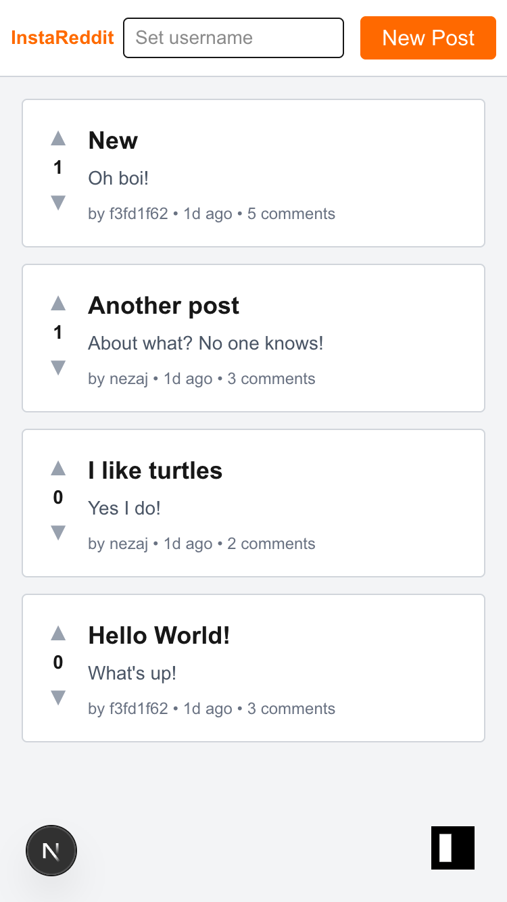

# Instant Mini Reddit

Mini reddit clone built with InstantDB, Next.js, and Tailwind. One-file app `src/app/page.tsx` with all the code to show a simple example of how to use InstantDB to build a relational CRUD app

Got any feedback or questions? Join our [Discord](https://discord.gg/hgVf9R6SBm)
